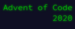

# Advent of Code  - 2020

My submissions for the Advent of Code, 2020 set of programming challenges. 

I chose to do these in Rust since I found myself with more free time than usual
and thought this would be a good opportunity to learn Rust. 

The hope is that as the month goes on, I get more used to writing idiomatic Rust
and begin thinking more carefully about references and lifetimes, with the end
goal being the ability to write performant and safe Rust code. 
